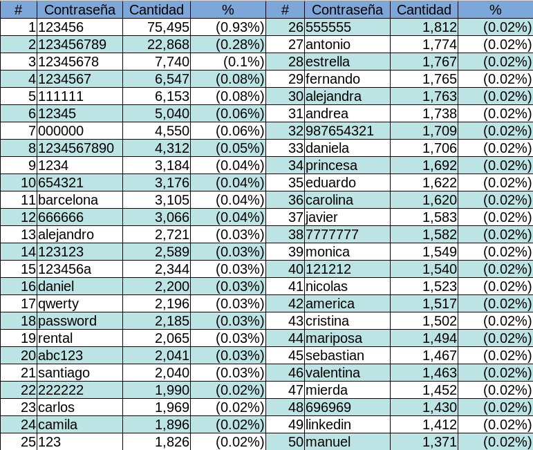

# Las contraseñas más comunes en países hispanohablantes

Año con año, la empresa SplashData [[1]](https://www.teamsid.com/100-worst-passwords/) publica una lista de las contraseñas más comunes encontradas en información filtrada a lo largo de dicho año. En mi experiencia en pruebas de penetración a redes y aplicaciones en países tanto de habla hispana como de habla inglesa, he podido verificar la efectividad de estas listas a la hora de intentar recuperar contraseñas cifradas o acceder a servicios protegidos, dicha efectividad se puede considerar aceptable en los países angloparlantes y deficiente, si no es que casi nula, en los países hispanohablantes. Lo que comprueba la idea intuitiva de que la cultura y el idioma materno deben jugar un rol mayor a la hora de elegir una palabra o frase fácil de recordar para proteger el acceso a nuestra información.

De este hecho nace la inquietud de generar una lista de las contraseñas más utilizadas por personas que comparten un idioma, español en este caso. Empecé esta tarea intentando recopilar las contraseñas descifradas en proyectos con varios clientes, desafortunadamente esto presentaba varios inconvenientes: primero que nada la cantidad de datos, por mucho material que un auditor pueda acumular a lo largo de los años, difícilmente superará unos cuantos miles de elementos; segundo, todos los datos acumulados serían derivados de entornos empresariales/gubernamentales relativamente uniformes, reduciendo además el espectro cultural de la muestra. 

Afortunadamente, para los profesionales de la seguridad, en diciembre de 2017 Julio Casal, de 4iQ, publicó [[2]](https://medium.com/4iqdelvedeep/1-4-billion-clear-text-credentials-discovered-in-a-single-database-3131d0a1ae14) el hallazgo de alrededor de mil cuatrocientos millones (sí, **1,400,553,869**) de juegos de nombre de usuario y contraseñas en sitios de la *dark web*, proveyéndonos así con un corpus bastante generoso para el análisis deseado.

Para la extracción de los datos y la distinción de aquellas cuentas propias de hispanohablantes opté por filtrar la totalidad de los registros por el dominio de primer nivel de las direcciones de correo electrónico, tomando únicamente aquellos que pertenecieran a países de habla hispana, por ejemplo *.es* para España, *.mx* para México, *.ar* para Argentina y así sucesivamente para el resto de países cuyo idioma oficial es el español. Entiendo que esto deja fuera a servicios como *Gmail* o *Outlook* y otros que tal vez concentran a la mayoría de los usuarios en la región, sin embargo, identificar el idioma del usuario en estos servicios requiere un análisis mucho más sofisticado y profundo.

Luego de haber aislado los datos relevantes fue necesario depurarlos eliminando entradas duplicadas (mismo usuario y contraseña), con contraseñas vacías o con nombres de dominio obviamente inexistentes, por ejemplo *\@gmail.com.mx*. De este proceso se obtienen los siguientes números:

- 8,112,226 combinaciones únicas de usuario y contraseña 
- 7,102,204 cuentas de usuario únicos 
- 5,469,678 contraseñas únicas 

En cuanto a la distribución de datos por país, se puede ver en la siguiente gráfica:

Cabe destacar que el 96.99% de las entradas provienen de sólo 5 países, esto da pie para profundizar en cuestiones de acceso a internet y tecnologías de la información y otros temas, pero no es el objetivo del presente artículo. La aportación a la muestra en estos países es como sigue:

- España: 4,533,965 
- México: 1,515,820 
- Argentina: 968,881 
- Colombia: 477,274 
- Chile: 372,486 

Para el procesamiento de la enorme cantidad de datos y la obtención de parámetros que son relevantes en un análisis de este tipo, se utilizó la herramienta *Pipal* [[3]](https://github.com/digininja/pipal). Pipal es un analizador de contraseñas que, además de hacer un conteo de las palabras más repetidas en una lista y otros análisis básicos permite también determinar el uso de distintos conjuntos de caracteres o contar el uso de palabras por categorías como deportes, religión, fechas,etc. Recomiendo a todos los Pentesters y auditores de seguridad que incorporen esta u otra herramienta similar en sus proyectos y reportes para dar visibilidad a sus clientes visibilidad acerca de los patrones de creación de contraseñas en sus organizaciones.

De acuerdo con los criterios antes mencionados, las 50 contraseñas más comunes entre hispanohablantes son las siguientes:

 
Es de resaltar la gran popularidad que tienen los nombres propios y las secuencias o repeticiones de números. Es interesante que la palabra contraseña, que sería el equivalente de password, la cual aparece siempre en los primeros cinco lugares en las listas globales, no alcanzó sino la posición 90 en esta lista. Me pareció también curiosa la aparición de la palabra rental en el lugar 19, yendo más a detalle, esta palabra presenta la mayor incidencia en Argentina y Colombia. 

Otra contraseña a notar es la numero 49, linkedin, probablemente muchos de los registros en el archivo provienen de las contraseñas filtradas de dicho sitio en 2012 [[4]](https://www.nytimes.com/2012/06/11/technology/linkedin-breach-exposes-light-security-even-at-data-companies.html).

Ahora, ¿Cómo se compara este resultado con las contraseñas más comunes en el conjunto completo de más de 1,400 millones? Casal publica en su artículo original una lista de las 40 contraseñas más frecuentes en dicho conjunto, la siguiente tabla indica en qué posición de dicha lista se encuentran, si es que aparecen, las correspondientes a países hispanohablantes:

 
Como podría esperarse, los nombres propios españoles no aparecen entre las contraseñas más populares a nivel global. Del resto, la mayor parte están ahí, con mayor o menor variación en su popularidad.

Yendo un poco más a detalle en cuanto a parámetros de seguridad de las contraseñas, comenzando con la longitud, la siguiente gráfica muestra los datos para contraseñas de 20 caracteres o menos:

De la muestra analizada, el 98.87% de las contraseñas son de hasta 15 caracteres y el 62.55% es de 8 caracteres o menos. 

Otro dato relevante son los conjuntos de caracteres, esto es, la combinación de letras mayúsculas, minúsculas, dígitos y caracteres especiales:

- Únicamente letras minúsculas: 3,075,202 (37.95%) 
- Letras minúsculas y números: 2,884,919 (35.6%) 
- Únicamente números: 1,179,249 (14.55%) 
- Alfanumérico: 192,827 (2.38%) 
- Alfabético (mayúsculas y minúsculas): 64,301 (0.79%) 
- Alfanumérico y caracteres especiales: 15,862 (0.2%) 

Es de destacar el limitado uso de los caracteres especiales o de diferentes conjuntos en general, con la gran mayoría de los usuarios (88.1%) recurriendo únicamente a letras minúsculas y números. Esto, aunado a que la mayoría de las contraseñas son relativamente cortas, nos habla de que aún si estas contraseñas se hubiesen almacenado de forma segura (utilizando un algoritmo criptográfico de hash), recuperar el texto plano sería una tarea trivial con una computadora moderna.

## Conclusión

Es claro que el idioma y trasfondo cultural juegan un papel central en la elección de una contraseña para proteger el acceso a la información, sería muy interesante ver las diferencias no solo entre inglés y español, sino incluir idiomas que usen incluso otros alfabetos, como el chino o japonés.

Aunque los datos utilizados son probablemente de 2011 o 2012, por la filtración a LinkedIn ya mencionada y por el hecho de que el año usado como parte de una contraseña más común  en la muestra fue 2011, podemos suponer que la lista no ha cambiado grandemente (así como casi no ha cambiado la lista global [[5]](https://www.cnet.com/news/the-25-worst-passwords-of-2011/)); esto nos habla de que probablemente, aún en estos días dónde mes con mes escuchamos de ataques cibernérticos y filtraciones de información en los medios de comunicación, la elección de contraseñas de los hispanohablantes se sigue limitando a nombres propios en minúsculas y secuencias o repeticiones de números, lo que facilita enormemente la labor de los atacantes que buscan descifrarlas o adivinarlas. Ojalá contar con esta lista, más cercana a nosotros que una basada en palabras inglesas, ayude a ir creando conciencia. 

## Referencias:

\[1\] https://www.teamsid.com/100-worst-passwords/

\[2\] https://medium.com/4iqdelvedeep/1-4-billion-clear-text-credentials-discovered-in-a-single-database-3131d0a1ae14

\[3\] https://github.com/digininja/pipal

\[4\] https://www.nytimes.com/2012/06/11/technology/linkedin-breach-exposes-light-security-even-at-data-companies.html

\[5\] https://www.cnet.com/news/the-25-worst-passwords-of-2011/
